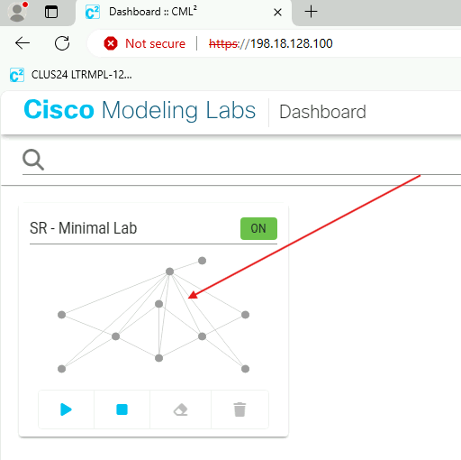
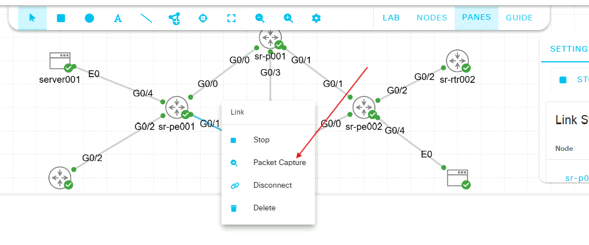
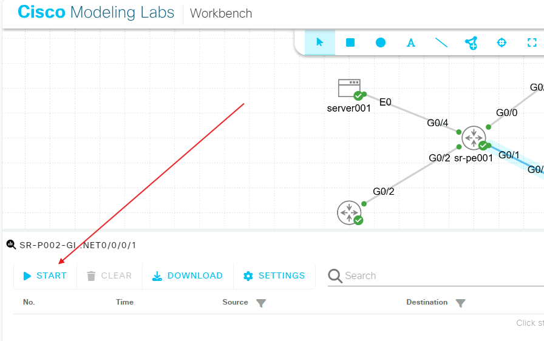
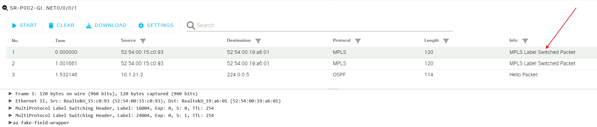
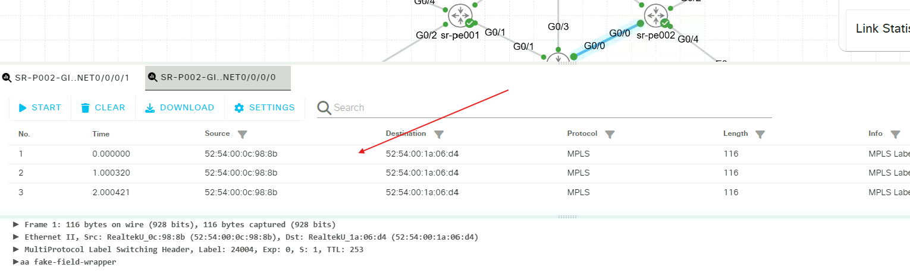

# Configure EVPN Servivces 

Some key terms for this task:
```
Attachment Circuit (AC): egress point of a router facing the Customer Edge (CPE) device 

VPWS: Virtual Private Wire Service.  This is a point to point Layer 2 circuit 

EVI:  EVPN Virtual Identifier.  This is the unique global identifier for an EVPN service
```

Both PE nodes in this network have two endpoints connected to them.  One endpoint type is a linux server, the other is an IOS-XE L3 switch.  Both linux servers need to talk to each other, and both switches need to talk to each other, but the linux hosts cannot talk to the switches.

To complete this task, we need to create an attachment circuit for each device and an ethernet VPN(EVPN overlay) between the linux hosts and another between the switches.  We will also need to verify the underlay and the overlay is working correctly.

### Important endpoint to switch mappings

Endpoint    |  Port  | Switch   |  Port |
----------  | ------ | -------  | ------
server001   | eth0   | sr-pe001 | Hu0/0/0/4
server002   | eth0   | sr-pe001 | Hu0/0/0/4
sr-rtr001   | Gi0/2  | sr-pe001 | Hu0/0/0/2
sr-rtr002   | Gi0/2  | sr-pe001 | Hu0/0/0/2


Linux server circuit information:
```bash
EVI: 1001
sr-pe001 AC: 11001
sr-pe002 AC: 21001
Vlan: untagged
```

## Step 1: Configure Attachment Circuits on PE nodes

1. Configure Subinterfaces on sr-pe001 and sr-pe002

Configure Hu0/0/0/4.1 as an L2 subinterface, accepting untagged traffic, and no-shut the interface and its parent interface, Hu0/0/0/4.

```bash
(config)#int Hu0/0/0/4
(config-if)#no shut
(config-if)#int Hu0/0/0/4.1 l2transport
(config-subif)#encapsulation untagged
(config-subif)#no shut
(config-subif)#commit
```

<details><summary><font size=4> Expand for L2transport details  </summary><pre><code></font>
IOS-XR must have its interfaces configured as ‘l2transport’ before it will recognize strictly L2 traffic on a subinterface. After a subinterface is designated as an L2
interface, it will understand that it must match the dot1q tag specified in its configuration in order to know which subinterface to pin traffic to. That subinterface is later assigned to a L2VPN service, thus stitching a tagged or untagged subinterface to a L2 service. <br></pre></code></details>  


## Step 2: Create EVPN Circuits on the PE Nodes

Now that the PE routers will know which ingress traffic will belong to this service, we can create the EVPN VPWS service itself. We will use xconnects to create the service. To complete this, we need a name for the xconnect group, and a name for the actual point-to-point circuit. These names are arbitrary, but should be useful to you, the engineer. Here, we will use group name ‘servers’ and p2p name ‘UNTAGGED’.

1. Create xconnect circuit and EVPN encapsulation on sr-pe001. 

```bash
(config)#l2vpn
(config-l2vpn)#xconnect group servers
(config-l2vpn-xc)#p2p UNTAGGED
(config-l2vpn-xc-p2p)#int hu0/0/0/4.1
(config-l2vpn-xc-p2p)#neighbor evpn evi 1001 target 21001 source 11001
(config-l2vpn-xc-p2p-pw)#commit
```

2. Create xconnect circuit and EVPN encapsulation on sr-pe002 

```bash
(config)#l2vpn
(config-l2vpn)# xconnect group servers
(config-l2vpn-xc)#  p2p UNTAGGED
(config-l2vpn-xc-p2p)#interface HundredGigE0/0/0/4.1
(config-l2vpn-xc-p2p)#neighbor evpn evi 1001 target 11001 source 21001
(config-l2vpn-xc-p2p-pw)#commit
```


## Step 3: Validate the overlay

At this time we should have a fully functional psuedowire between the two servers. We will validate on the servers as well as the PE routers. 

1. Validate xconnect status on sr-pe001 and sr-pe002

```bash
RP/0/RP0/CPU0:sr-pe002#show l2vpn xconnect
Thu May 29 23:56:12.173 UTC
Legend: ST = State, UP = Up, DN = Down, AD = Admin Down, UR = Unresolved,
        SB = Standby, SR = Standby Ready, (PP) = Partially Programmed,
        LU = Local Up, RU = Remote Up, CO = Connected, (SI) = Seamless Inactive

XConnect                   Segment 1                       Segment 2
Group      Name       ST   Description            ST       Description            ST
------------------------   -----------------------------   -----------------------------
servers    UNTAGGED   UP   Hu0/0/0/4.1            UP       EVPN 1001,11001,3.3.3.3
                                                                                  UP
----------------------------------------------------------------------------------------
RP/0/RP0/CPU0:sr-pe002#
```
notice that each segment has an ST of *UP*. 


2. Validate the EVPN on the servers

For this step you will log into each server via SSH with Putty utilizing the provided password in the main page(cisco). Once logged in, validate the IP address and send 3 pings to the respective server. 

```bash
ip address show dev eth0
```
You should have output similar to below, verifying eth0's network facing the PE:

```bash
2: eth0: <BROADCAST,MULTICAST,UP,LOWER_UP> mtu 1500 qdisc pfifo_fast state UP qlen 1000
    link/ether 52:54:00:1c:e3:53 brd ff:ff:ff:ff:ff:ff
    inet 10.10.1.1/24 scope global eth0
       valid_lft forever preferred_lft forever
    inet6 fe80::5054:ff:fe1c:e353/64 scope link 
       valid_lft forever preferred_lft forever
```
Ping the server002's eth0 interface:

```bash
server001:~$ ping 10.10.1.2 -c 3
PING 10.10.1.2 (10.10.1.2): 56 data bytes
64 bytes from 10.10.1.2: seq=0 ttl=42 time=5.440 ms
64 bytes from 10.10.1.2: seq=1 ttl=42 time=5.608 ms
64 bytes from 10.10.1.2: seq=2 ttl=42 time=5.277 ms

--- 10.10.1.2 ping statistics ---
3 packets transmitted, 3 packets received, 0% packet loss
round-trip min/avg/max = 5.277/5.441/5.608 ms

```
Repeat for server002:

```bash
ip address show dev eth0
```
```bash
2: eth0: <BROADCAST,MULTICAST,UP,LOWER_UP> mtu 1500 qdisc pfifo_fast state UP qlen 1000
    link/ether 52:54:00:d2:5b:72 brd ff:ff:ff:ff:ff:ff
    inet 10.10.1.2/24 scope global eth0
       valid_lft forever preferred_lft forever
    inet6 fe80::5054:ff:fed2:5b72/64 scope link 
       valid_lft forever preferred_lft forever
```
```bash
server002:~$ ping 10.10.1.1 -c 3
PING 10.10.1.1 (10.10.1.1): 56 data bytes
64 bytes from 10.10.1.1: seq=0 ttl=42 time=5.511 ms
64 bytes from 10.10.1.1: seq=1 ttl=42 time=9.494 ms
64 bytes from 10.10.1.1: seq=2 ttl=42 time=5.519 ms

--- 10.10.1.1 ping statistics ---
3 packets transmitted, 3 packets received, 0% packet loss
round-trip min/avg/max = 5.511/6.841/9.494 ms
server002:~$
```

## Step 3: Verify the underlay -- BGP -- On PE nodes 

BGP advertises the PE endpoints of each circuit and also the service label associated with the circuit on each PE. The service label is dynamic and may differ from what you see in the output below.

1. Show the BGP L2VPN table on sr-pe001 - EVPN SAFI

```bash

RP/0/RP0/CPU0:sr-pe001#show bgp l2vpn evpn
Fri May 30 00:12:38.708 UTC
BGP router identifier 3.3.3.3, local AS number 65001
<snip>

Status codes: s suppressed, d damped, h history, * valid, > best
              i - internal, r RIB-failure, S stale, N Nexthop-discard
Origin codes: i - IGP, e - EGP, ? - incomplete
   Network            Next Hop            Metric LocPrf Weight Path
Route Distinguisher: 3.3.3.3:1001 (default for vrf VPWS:1001)
Route Distinguisher Version: 4
*> [1][0000.0000.0000.0000.0000][11001]/120
                      0.0.0.0                                0 i
*>i[1][0000.0000.0000.0000.0000][21001]/120
                      4.4.4.4                       100      0 i
Route Distinguisher: 4.4.4.4:1001
Route Distinguisher Version: 3
*>i[1][0000.0000.0000.0000.0000][21001]/120
                      4.4.4.4                       100      0 i
* i                   4.4.4.4                       100      0 i
Processed 3 prefixes, 4 paths
```

2. Show the BGP L2VPN table on sr-pe002 - EVPN SAFI

```bash
RP/0/RP0/CPU0:sr-pe002#show bgp l2vpn evpn
Fri May 30 00:07:56.765 UTC
BGP router identifier 4.4.4.4, local AS number 65001
<snip>
Status codes: s suppressed, d damped, h history, * valid, > best
              i - internal, r RIB-failure, S stale, N Nexthop-discard
Origin codes: i - IGP, e - EGP, ? - incomplete
   Network            Next Hop            Metric LocPrf Weight Path
Route Distinguisher: 3.3.3.3:1001
Route Distinguisher Version: 3
*>i[1][0000.0000.0000.0000.0000][11001]/120
                      3.3.3.3                       100      0 i
* i                   3.3.3.3                       100      0 i
Route Distinguisher: 4.4.4.4:1001 (default for vrf VPWS:1001)
Route Distinguisher Version: 4
*>i[1][0000.0000.0000.0000.0000][11001]/120
                      3.3.3.3                       100      0 i
*> [1][0000.0000.0000.0000.0000][21001]/120
                      0.0.0.0                                0 i

Processed 3 prefixes, 4 paths
```

<details><summary><font size=4> Expand for EVPN Table Details  </summary><pre><code></font>

```bash
Route Distinguisher: 3.3.3.3:1001 (default for vrf VPWS:1001)
```
This is the circuit's Route Distinguisher on the local router.  The RD is 3.3.3.3:1001 which is broken down into the 
local router's BGP router-id : circuit EVI number.  This is how we identify the VPN and the PE node.
```angular2html
*> [1][0000.0000.0000.0000.0000][11001]/120 0.0.0.0                 0       i 
*>i[1][0000.0000.0000.0000.0000][21001]/120 4.4.4.4         100     0       i
```
These are the 'routes' for this VPN.  Broken down, we see 
* [1]: BGP EVPN route type 1.  Route Type 1 is always used for VPWS circuits
* [0000.0000.0000.0000.0000]: Ethernet Segment Identifier for the PE's AC. VPWS is a singular point to point, so 
there is 
only one AC per PE.  Hence, all zeros's.
* [11001] and [21001]: source and target AC identifiers for each PE
* /120: Administrative Distance for this route.  Default AD for iBGP routes is 120.

The next hop for each 'route' is listed as 0.0.0.0 (local router) and 4.4.4.4 (remote PE node).  The router is smart 
enough to not route packets that have been sourced on the local AC back to itself, so it will forward all ingress 
packets to the next hop, 4.4.4.4.

The RD 4.4.4.4:1001 and its associated routes is what is learned from the remote PE, sr-pe002.

BGP also advertises the service labels for each circuit. Traditionally this was done by LDP. To see the labels that 
are advertised, run the following command on each PE node: <br></pre></code></details>  


3. Show BGP L2VPN EVPN table with labels 

```bash
RP/0/RP0/CPU0:sr-pe001#show bgp l2vpn evpn labels
<snip>
Status codes: s suppressed, d damped, h history, * valid, > best
              i - internal, r RIB-failure, S stale, N Nexthop-discard
Origin codes: i - IGP, e - EGP, ? - incomplete
   Network            Next Hop        Rcvd Label      Local Label
Route Distinguisher: 3.3.3.3:1001 (default for vrf VPWS:1001)
Route Distinguisher Version: 4
*> [1][0000.0000.0000.0000.0000][11001]/120
                      0.0.0.0         nolabel         nolabel
*>i[1][0000.0000.0000.0000.0000][21001]/120
                      4.4.4.4         24004           nolabel
Route Distinguisher: 4.4.4.4:1001
Route Distinguisher Version: 3
*>i[1][0000.0000.0000.0000.0000][21001]/120
                      4.4.4.4         24004           nolabel
* i                   4.4.4.4         24004           nolabel

Processed 3 prefixes, 4 paths

```
<details><summary><font size=4> Expand for EVPN Table Details with Labels </summary><pre><code></font>
RD 4.4.4.4:1001 has two routes, one with destination of the local router (its outbound advertisement to neighbors) and 
one with destination remote PE router 3.3.3.3.  The local router doesnt have a label from the local router's perspective.  
This is why there is no label for the local route.  However, we see the service label of 24004 advertised from remote 
node 3.3.3.3.  Any SR-MPLS packets forwarded from the local router to node 3.3.3.3 for this service will have label 24004
pushed onto the bottom of its label stack. <br></pre></code></details>  

## Step 4: Verify the underlay--MPLS Forwarding

As mentioned earlier, SR Prefix (and other) labels are stored in the IGP.  We can lookup a service's destination prefix label in OSPF.  Do that on sr-pe001:

```bash
RP/0/RP0/CPU0:sr-pe001#show ospf sid-database
Fri May 30 00:20:20.185 UTC

SID Database for ospf 1 with ID 3.3.3.3

SID          Prefix/Mask
--------     ------------------
1            1.1.1.1/32
2            2.2.2.2/32
3            3.3.3.3/32               (L)
4            4.4.4.4/32
RP/0/RP0/CPU0:sr-pe001#

```
You should output similar to the above

Because we know our global sid database range starts at 16000, we can deduce that the prefix-sid for prefix 4.4.4.4/32 is 16004.  Index 3 is the label for the local router's prefix, 3.3.3.3/32, as denoted by the '(L)'.

We know the remote label was learned via BGP.  We can discover the label assigned for the service by the local router by reviewing the MPLS forwarding table. On node <b>sr-pe001</b>:

```bash
RP/0/RP0/CPU0:sr-pe001#show mpls forwarding
Fri May 30 00:24:32.718 UTC
Local  Outgoing    Prefix             Outgoing     Next Hop        Bytes
Label  Label       or ID              Interface                    Switched
------ ----------- ------------------ ------------ --------------- ------------
16001  Pop         SR Pfx (idx 1)     Hu0/0/0/0    10.1.11.1       0
       16001       SR Pfx (idx 1)     Hu0/0/0/1    10.1.21.1       0            (!)
16002  Pop         SR Pfx (idx 2)     Hu0/0/0/1    10.1.21.1       0
       16002       SR Pfx (idx 2)     Hu0/0/0/0    10.1.11.1       0            (!)
16004  16004       SR Pfx (idx 4)     Hu0/0/0/0    10.1.11.1       100
       16004       SR Pfx (idx 4)     Hu0/0/0/1    10.1.21.1       1696
24000  Pop         SR Adj (idx 0)     Hu0/0/0/1    10.1.21.1       0
24001  Pop         SR Adj (idx 0)     Hu0/0/0/1    10.1.21.1       0
       16004       SR Adj (idx 0)     Hu0/0/0/0    10.1.11.1       0            (!)
24002  Pop         SR Adj (idx 0)     Hu0/0/0/0    10.1.11.1       0
24003  Pop         SR Adj (idx 0)     Hu0/0/0/0    10.1.11.1       0
       16001       SR Adj (idx 0)     Hu0/0/0/1    10.1.21.1       0            (!)
24004  Pop         PW(EVI=1001 AC-ID=21001)   \
                                      Hu0/0/0/4.1  point2point     0
RP/0/RP0/CPU0:sr-pe001#

```
Let's focus on two sections of this output.
```bash
16004 16004     SR Pfx (idx 4) Hu0/0/0/0 10.1.11.1 0
      16004     SR Pfx (idx 4) Hu0/0/0/1 10.1.21.1 1184
```
This is showing us that we have two outgoing interfaces for label 16004, or index 4.  Our egress interfaces are Hu0/0/0/0 and Hu0/0/0/1.  This is due to ECMP and having two equal cost routes from the IGP.  We can also see that we are using Hu0/0/0/1 because Hu0/0/0/0 has zero bytes switched.
```bash
24004 Pop       PW(EVI=1001 AC-ID=21001) Hu0/0/0/4.1 point2point 0
```
This is the label for the EVPN service we created.  This is our local label and it just happens to be the same as the remote label on node sr-pe002 that we learned from BGP.  This line shows us the EVI, and the remote node's AC-ID and egress interface.

Your output may differ slightly from what is shown above.  Find the egress interface of the sr-pe001 node by finding the non-zero value in the 'Bytes Switched' column of your output.  Remember this interface ID for the next verification Step 5.

## Step 5: Verify the underlay--Packet Capture

Return to the cli of server001.  Start a ping to server002 and let it run:
```bash
server001:~$ ping 10.10.1.2
PING 10.10.1.2 (10.10.1.2): 56 data bytes
64 bytes from 10.10.1.2: seq=0 ttl=42 time=8.178 ms
64 bytes from 10.10.1.2: seq=1 ttl=42 time=7.696 ms
<snip>
```
Open the Edge Browser on the remote workstation and log in to CML. Click on the picture of the lab.



Next, right click on the link that corresponds to the interface on sr-pe001's outgoing interface found in Step 4.  We previously identified Hu0/0/0/1 as the outgoing interface in this guide, but yours may differ.  Hu0/0/0/1 of sr-pe001 corresponds to Hu0/0/0/1 in the CML map, so we right-click on Hu0/0/0/1.  In the context menu that pops up, clck 'Packet Capture'.



A Packet Capture tab will appear in the lower pane of the browser page.  Click 'Start'.



Find an MPLS Label Switched Packet and click on it.



In the new frame that populates at the bottom, we can see the contents of that MPLS packet.  Take note of the label stack.  The label stack for this outgoing packet is [16004][24004].  Recall that routers will read the top label of the stack only.  The next hop router, sr-p002 in this case, will get a packet with [16004] at the top of its stack.  sr-p002 will then perform a lookup in its IGP for sr-label 16004.  We established that OSPF's sid-database know that label 16004 corresponds to prefix route 4.4.4.4/32, which is sr-pe002's loopback address.

Now right click on the next hop router's interface that faces sr-pe002.  If the next hop router in your lab is sr-p001, you will be selecting Hu0/0/0/1 of sr-p001.  If your next hop is sr-p002 then you will selecting interface Hu0/0/0/2 of sr-p002.  Repeat the packet capture procedure for this interface.



Node sr-p002 is the penultimate hop for sr-pe002.  Accordingly, sr-p002 has removed the label [16004] from the label stack and only [24004] remains.  When sr-pe002 receives the packet with label [24004] it will know that this packet belongs to the EVPN service with EVI 1001, AC-ID 21001.

Return to server001 and stop the ping.


[Prev Task](..task2/task2.md) | [Next Task](../task4/task4.md) 
