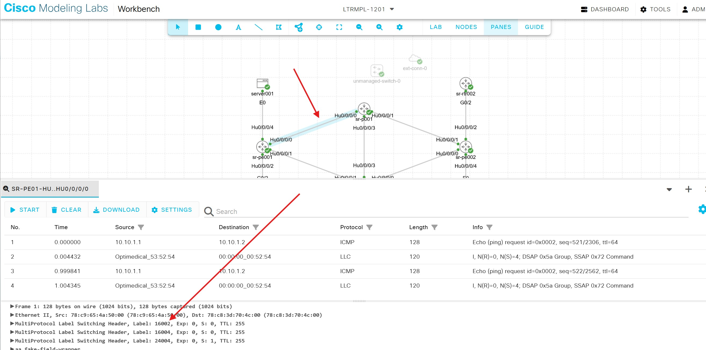
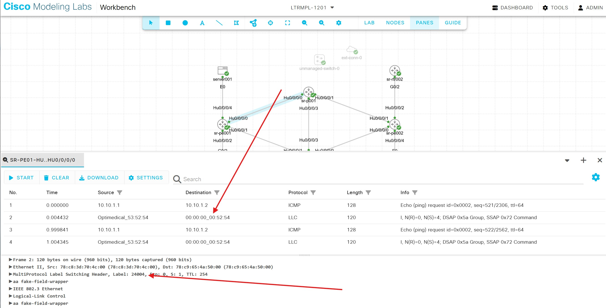

# Segment Routing Traffic Engineering 

Welcome to our Bonus Task, SR-TE!  If you have made it this far, then you have been excellent, task-driven students and wasted no time in getting to this section.  We will be configuring an explicit SID list to force packets to traverse  the link between sr-p001 and sr-p002, interface Hun0/0/0/3 on both nodes.  Normally, this link is not used because it would create an extra hop, and SR will always default to following the IGP path toward its destination.  The policy will override the IGP path.  Our policy will only affect traffic in one direction.

Before we begin, lets turn on MPLS Operations and Administration Management (OAM) functionality on each router.  This will let us trace mpls packets through the network.

On each router, enable mpls oam:
```bash
(config)#mpls oam
(config)#commit
(config)#end
```
We can now ping and traceroute through the underlay and verify MPLS end to end.  But for our purposes, we'll see the exact interfaces and labels used to reach an endpoint.

From sr-pe001, execute a traceroute to sr-pe002:
```angular2html
sr-pe001#traceroute mpls ipv4 4.4.4.4/32

Tracing MPLS Label Switched Path to 4.4.4.4/32, timeout is 2 seconds

<snip>

Type escape sequence to abort.

  0 10.1.12.2 MRU 1500 [Labels: 16004 Exp: 0]
L 1 10.1.12.1 MRU 1500 [Labels: implicit-null Exp: 0] 11 ms
! 2 10.1.22.2 12 ms
```
From this output we see the next hop is sr-p002.  Yours may be sr-p001.  The MPLS label that is used to reach 4.4.4.4/32 is 16004, which is the Prefix-sid we assigned to sr-pe002's Loopback0 interface.  The second hop is sr-p002 and the label has now been stripped because this router is also the penultimate hop router.  The packet is then forwarded to sr-pe002 with no label in the third hop.

### We are now ready to create an Explicit SID-List policy

Creating this policy requires three steps:
1) Create the explicit SID list
2) Create the policy that will utilize the SID list
3) Steer the traffic from the EVPN into the policy
## Step 1: Configure SID-List
Recall that another term for Segment Routing is 'Source Routing'.  This is because the instructions are delivered at the source, or beginning, of the path.  Because sr-pe001 is the beginning of our EVPN circuit, we need to create an explicit SID-List on the sr-pe001 node.  This process requires you to make an indexed list of SIDs that will be used as the label stack for the packets in the service.  The highest numbered index will be on the bottom of the stack as the routers will read the stack top-down.  We will use the SIDs of the routers sr-p001, sr-p002, and sr-pe002 to create the SID-list.

Apply the following configuration on sr-pe001:
```bash
(config)#segment-routing
(config-sr)#traffic-eng
(config-sr-te)#segment-list 1to2extrahop
(config-sr-te-sl)#index 10 mpls label 16001
(config-sr-te-sl)#index 20 mpls label 16002
(config-sr-te-sl)#index 30 mpls label 16004
(config-sr-te-sl)#commit
(config-sr-te-sl)#end
```

## Step 2: Configure SR-TE policy
All policies follow the {color,endpoint} tuple identification standard.  You may create a policy with a friendly name in your configuration, but the router will identify the policy based on the tuple name, represented as 'srte_c_[color]_ep_[endpoint]'.  We will create a policy with a friendly name then apply the policy in Step 3 using the tuple representation.

As you  may have observed, you need a color and the endpoint to uniquely identify this policy on the router.  We will use the color '5001' and keep the endpoint ip of '4.4.4.4'.
<details><summary><font size=4> Expand for SR-TE Policy details  </summary><pre><code></font>
Every policy consists of at least one candidate path.  The router will calculate the validity of a candidate path 
and will use the valid path with the highest preference.  If a candidate path becomes invalid at any time for any 
reason, it wil lbe marked operationally down and the next candidate path will be used.  If there are no valid 
candidate paths available, the default behavior will be to use the IGP.  It is possible to force the policy to 
drop packets in the event there are no valid paths.
<br></pre></code></details> 

Apply the following configuration on sr-pe001:
```bash
(config)#segment-routing
(config-sr)#traffic-eng
(config-sr-te)#policy my_first_SR-TE_policy
(config-sr-te-policy)#color 5001 end-point ipv4 4.4.4.4
(config-sr-te-policy)#candidate-paths
(config-sr-te-policy-path)#preference 100
(config-sr-te-policy-path-pref)#explicit segment-list 1to2extrahop
(config-sr-te-pp-info)#commit
(config-sr-te-pp-info)#end
```

## Step 3: Steer service traffic into the policy
The last step actually requires two tasks: create a psuedowire-class with the preferred-path marked as the SR-TE policy, and then assign the psuedowire-class to the EVPN.

Recall that the router will identify the SR-TE policy by the tuple naming standard, not the friendly name of 'my_first_SR-TE_policy'.  Discover the router's name of the policy with a show command:

```bash
show segment-routing traffic-eng policy color 5001
```
```
SR-TE policy database
---------------------

Color: 5001, End-point: 4.4.4.4
  Name: srte_c_5001_ep_4.4.4.4
  Status:
    Admin: up  Operational: up for 00:00:08 (since Apr 18 19:24:25.162)
  Candidate-paths:
    Preference: 100 (configuration) (active)
      Name: my_first_SR-TE_policy
      Requested BSID: dynamic
      Constraints:
        Protection Type: protected-preferred
        Maximum SID Depth: 8 
      Explicit: segment-list 1to2extrahop (valid)
        Weight: 1, Metric Type: TE
          SID[0]: 16001
          SID[1]: 16002
          SID[2]: 16004
  Attributes:
    Binding SID: 24007
    Forward Class: Not Configured
    Steering labeled-services disabled: no
    Steering BGP disabled: no
    IPv6 caps enable: yes
    Invalidation drop enabled: no
    Max Install Standby Candidate Paths: 0
    Path Type: SRMPLSv4
```
<details><summary><font size=4> Expand for Binding SID details  </summary><pre><code></font>
The friendly name is listed under the Candidate-paths section of the output.  What we need for this step is here:

> Color: 5001, End-point: 4.4.4.4<br>
>  Name: srte_c_5001_ep_4.4.4.4

This is the router's tuple name for the policy.

>Attributes:<br>
> Binding SID: 24007

This is the Binding SID number the router dynamically assigned to the policy.  It is possible to manually assign a 
Binding SID out of the local segment block.  If a Binding SID were statically assigned, it may be referenced by 
another policy on a remote router.

We need to use the tuple identification name the router created to steer the service traffic into the policy.
<br></pre></code></details> 
Apply the following configuration on sr-pe001:
```bash
(config)#l2vpn
(config-l2vpn)# pw-class servers-te
(config-l2vpn-pwc)#  encapsulation mpls
(config-l2vpn-pwc-mpls)#   preferred-path sr-te policy srte_c_5001_ep_4.4.4.4
(config-l2vpn-pwc-mpls)#commit
(config-l2vpn-pwc-mpls)#root
```
Now that the psuedowire-class has been created, we can assign it to EVI 1001 to change the path of the servers' service:
```bash
(config)#l2vpn
(config-l2vpn)#xconnect group servers
(config-l2vpn-xc)#p2p UNTAGGED
(config-l2vpn-xc-p2p)#neighbor evpn evi 1001 target 21001 source 11001
(config-l2vpn-xc-p2p-pw)#pw-class servers-te
(config-l2vpn-xc-p2p-pw)#commit
(config-l2vpn-xc-p2p-pw)#end
```
## Step 3: Verify the policy is working
Log in to server001 and ping server002, 10.10.1.2.  If the ping is working, let it continue to run.

Verify 'my_first_SR-TE_policy' is operational on sr-pe001:
```bash
show segment-routing traffic-eng policy color 5001
```

<pre><code>
SR-TE policy database
---------------------

Color: 5001, End-point: 4.4.4.4
 Name: srte_c_5001_ep_4.4.4.4
  Status:
    Admin: up  Operational: up for 00:10:33 (since Apr 18 19:24:25.162)
  Candidate-paths:
    Preference: 100 (configuration) (active)
      Name: my_first_SR-TE_policy
      Requested BSID: dynamic
      Constraints:
        Protection Type: protected-preferred
        Maximum SID Depth: 8 
      Explicit: segment-list 1to2extrahop (valid)
        Weight: 1, Metric Type: TE
          SID[0]: 16001
          SID[1]: 16002
          SID[2]: 16004
  Attributes:
    Binding SID: 24007
    Forward Class: Not Configured
    Steering labeled-services disabled: no
    Steering BGP disabled: no
    IPv6 caps enable: yes
    Invalidation drop enabled: no
    Max Install Standby Candidate Paths: 0
    Path Type: SRMPLSv4
</code></pre>

<details><summary><font size=4> Expand for SR-TE Policy Validation details  </summary><pre><code></font>
As we can see with this line,
> Admin: up  Operational: up for 00:10:33 (since Apr 18 19:24:25.162)

the path is up and operational.
<br></pre></code></details> 

### Verify the policy with OAM
On sr-pe001, we will use MPLS OAM functionality to verify the path and label stack.  Use the binding-sid assigned to your policy to test the path.
```bash
sr-pe001#traceroute sr-mpls policy binding-sid 24007 lsp-end-point 4.4.4.4

Tracing MPLS Label Switched Path over SR Policy with binding SID Label [24007], timeout is 2 seconds

<snip>

Type escape sequence to abort.

  0 10.1.11.2 MRU 1500 [Labels: 16002/16004 Exp: 0/0]
L 1 10.1.11.1 MRU 1500 [Labels: implicit-null/16004 Exp: 0/0] 9 ms
L 2 10.1.33.2 MRU 1500 [Labels: implicit-null Exp: 0] 10 ms
! 3 10.1.22.2 12 ms
```
<details><summary><font size=4> Expand for OAM Validation details  </summary><pre><code></font>
Here, we use MPLS OAM functionality to perform a traceroute using the sr-policy we created.  We used the binding-sid the router assigned to our policy that we learned from 'show segment-routing traffic-eng policy color 5001'.  We also provided the sr-pe002's Loopback0 ip address for the lsp-end-point.
Hop 0 shows the packet going over our Hu0/0/0/0 interface with 16002/16004 in our packet's label stack.  16001 was on top of the stack in the policy, but the router strips this label before sending it to sr-p001.  
Hop 1 shows the packet at sr-p001. 16002 gets stripped (the implicit-null) and only 16004 remains on the stack.  16002 is the label for sr-p002 so the packet is forwarded to sr-p002 next.  
Hop 2 is sr-p002, and the final label gets stripped before forwarding to the end-point, sr-pe002. Notice on Hops 1 and 2, these have an 'L' at the beginning of the line.  This shows a labeled output interface was used to reach these hops. Therefore, sr-pe001 and sr-p001's output interfaces inserted SR labels to the packet before forwarding.
Hop 3 is the end-point returning the final traceroute icmp message.
</code></pre></details><br>

Return to the Edge web browser and open the lab in CML.  Right-click on the link Hu0/0/0/0 between sr-pe001 and sr-p001.  Select Packet Capture.  In the new tab that opens in the bottom pane, click 'Start'.

You will see MPLS Switched Packets populate the capture pane.  Some of these packets may be return packets from sr-pe002.  Click on one of the packets and review the label stack.  You should see labels in the header with 16002 followed by 16004.  recall that node sr-pe001 will strip the first label, 16001, from the label stack before it forwards the packet to sr-p001 because label 16001 is the next hop from sr-pe001.


<details><summary><font size=4> Expand for Packet Capture Validation details  </summary><pre><code></font>
In the above image, you see three labels in the packet's label stack: 16002, 16004, and 24004.  The first two labels are the transit labels; they are used to get from one end of the transport network to the other PE router.  The final label is the dynamically created service label, 24004.  This tells sr-pe002 which EVPN service this packet belongs to.  This is how the PE differentiates packets destined for various services hosted on the router.  sr-pe002 will pop the 24004 label and forward the packet out of interface Hu0/0/0/4.1 toward server002.

#### What will be in the return packet's label stack as it leaves sr-pe002?
</code></pre></details>

If you select a packet with a single label value in the label stack with a dynamic service label as shown below, then you have selected a return packet and you should click on another packet for review.



That's it!  Congratulations.  You've successfully built an Underlay, Overlay, two EVPN services, and an SR-TE policy.  There's much more to learn, but we hope we have created a good understanding for you, and that you have a good starting point with this lab.

[Prev Task](../task4/task4.md) | [Home](../README.md) 
